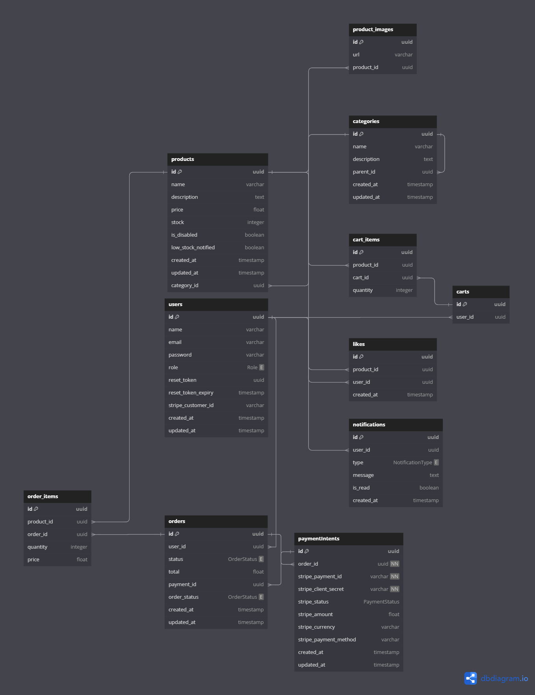

# API Documentation

## Overview

This API provides a robust system for managing users, products, categories, shopping carts, orders, and payments. It includes user authentication, role-based access, and integrations with Stripe for secure payment processing.

## Introduction

This API allows seamless management of e-commerce functionalities, including user registrations, product handling, order processing, and payment systems. It integrates with Stripe for payments and ensures secure and efficient operations.

---

## Project Structure

The project follows a modular structure:

- **Authentication**: Registration, login, and password recovery.
- **Users**: User profile management.
- **Products**: CRUD operations for products.
- **Orders**: Order creation and tracking.
- **Payments**: Stripe integration for secure transactions.

---

## Entity Relationship Diagram

